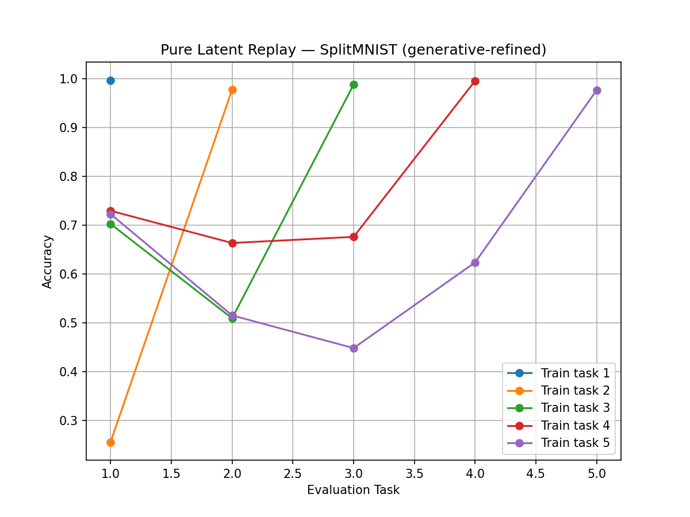
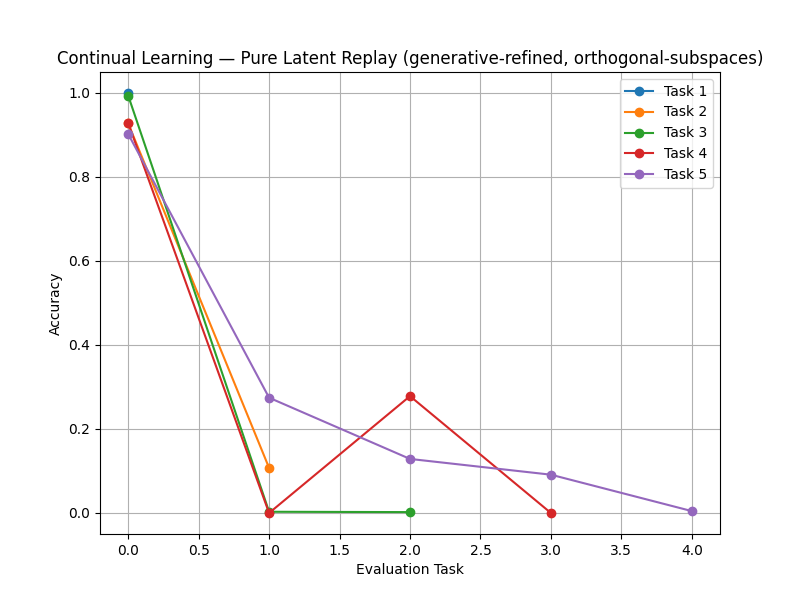

# Continual Learning with Pure Latent Replay (DCE-CVAE)

Class-incremental learning on Split-MNIST using **pure latent replay**: rather than storing raw images from earlier tasks, the model stores and replays compressed latent vectors. Built on a DCE-CVAE backbone with a four-tier memory hierarchy.

Two configurations were run. One converges; one does not. Both are documented below.

## Setup

Split-MNIST, five tasks learned in sequence:

| Task | Digits |
|---|---|
| 1 | 0, 1 |
| 2 | 2, 3 |
| 3 | 4, 5 |
| 4 | 6, 7 |
| 5 | 8, 9 |

Class-incremental, not task-incremental: at test time the model receives no task label and must choose among all ten digits. Naive sequential fine-tuning collapses to roughly 0.20 in this setting, retaining only the most recent pair.

## Architecture

**Backbone** (`dce_cvae_model.py`) — a class-conditional VAE with a classifier head on the latent mean:

```
Encoder:     28x28x1 -> Conv(32) -> Conv(32) -> MaxPool -> Conv(64) -> MaxPool -> FC(256) -> mu, logvar   (latent_dim = 128)
Decoder:     [z || one-hot(y)] -> FC(256) -> FC(64*7*7) -> Upsample -> Conv -> Upsample -> Conv -> 28x28
Classifier:  Linear(128 -> 10) on mu
```

**Memory** (`hybrid_memory.py`) — four tiers:

| Tier | Contents | Size |
|---|---|---|
| `HotLatentBuffer` | FIFO of recent latents `(z, y, task_id)` | 50,000 |
| `DNAMemory` | Distilled per-class prototypes, ingested from the hot buffer | >= 80 per class |
| `ExemplarMemory` | Raw exemplars — the only place pixels are kept | 1,000 |
| `AdapterManager` | Fixed orthonormal basis per task | 12 of 128 dims |

Storing 128-float latents instead of 784-pixel images is what keeps the memory footprint small.

**Hyperparameters** — latent_dim 128, lr 5e-4, beta_vae 0.20, 6 epochs per task, batch 128, stability_gamma 0.20, replay VAE weight 0.4, hot ratio 0.30, cold ratio 0.10, exemplar weight 1.5. Task 0 is a special case: beta_vae drops to 0.01 and the decoder is frozen for the first 3 epochs, so the classifier establishes a usable latent space before reconstruction competes for capacity.

---

## Run A — pure latent replay



Accuracy on each evaluation task, measured after each training stage:

| Evaluated on -> | T1 | T2 | T3 | T4 | T5 |
|---|---|---|---|---|---|
| **After task 1** | 1.00 | | | | |
| **After task 2** | 0.25 | 0.98 | | | |
| **After task 3** | 0.70 | 0.51 | 0.99 | | |
| **After task 4** | 0.73 | 0.66 | 0.68 | 0.99 | |
| **After task 5** | 0.72 | 0.51 | 0.45 | 0.62 | 0.98 |

| Metric | Value |
|---|---|
| Average accuracy after all 5 tasks | **0.66** |
| Average forgetting | 0.41 |
| Naive fine-tuning (reference) | 0.20 |

Task 1 accuracy drops to 0.25 immediately after task 2, then recovers to ~0.70 and holds for the remainder of the sequence. `DNAMemory` requires at least 80 samples per class before it contributes, so it cannot assist during the first transition and does from task 3 onward. The collapse and the recovery share the same cause.

---

## Run B — with orthogonal subspace projection



Same backbone, same memory, one change: replayed latents are projected into a fixed per-task orthogonal subspace before use. `AdapterManager` builds a random orthonormal basis `P_t` per task by QR decomposition at initialisation and projects via `P_t P_t^T`. With `latent_dim = 128` and `max_tasks = 10`, each task receives 12 of 128 dimensions.

Accuracy on each evaluation task, after all five tasks:

| Evaluated on | T1 | T2 | T3 | T4 | T5 |
|---|---|---|---|---|---|
| Accuracy | 0.90 | 0.27 | 0.13 | 0.09 | 0.00 |

Average accuracy after all 5 tasks: **0.28**.

---

## Comparison

| | Run A | Run B |
|---|---|---|
| Replayed latents | full 128-d | projected to a 12-d per-task subspace |
| Subspace basis | none | fixed random orthonormal, set at initialisation |
| Average accuracy, end of sequence | **0.66** | 0.28 |
| Task 1 accuracy, end of sequence | 0.72 | **0.90** |
| Task 5 accuracy, end of sequence | **0.98** | 0.00 |

**What went wrong in Run B is not forgetting.** It retains task 1 at 0.90 — higher than Run A does — while scoring near zero on the tasks learned most recently. The model stopped acquiring new tasks rather than losing old ones. That is a plasticity failure, not a stability failure, and it is the opposite of the problem the projection was added to solve.

Three properties of the projection are consistent with that outcome:

1. **Capacity.** Twelve of 128 dimensions per task discards most of the latent's variance. A 12-dimensional random subspace is unlikely to span what is needed to separate a digit pair, so replayed samples carry a degraded version of their original signal.

2. **Distribution mismatch.** Replayed samples arrive projected while current-task samples arrive in the full 128-d space. The classifier is therefore trained on two different input distributions, and the replay term pulls it toward the projected one.

3. **Fixed random bases.** The bases are drawn once from a Gaussian and never adapted, so nothing aligns them with the directions the encoder actually uses — and the encoder keeps training, so those directions drift while the bases stay put.

Combined with the replay weighting (hot ratio 0.30, exemplar weight 1.5, alignment term 0.25), the replay signal dominates the gradient from the current task and the model settles on the first task it saw.

These are readings of the code and the plotted matrices, not results of a controlled ablation. Isolating the cause would require separate runs varying `per_task_dim`, the projection on and off, and learned versus random bases.

---

## Running it

```bash
git clone https://github.com/Ayai1/continual-learning-dce-cvae
cd continual-learning-dce-cvae
pip install torch torchvision matplotlib numpy
python hybrid_dna_dce_cvae_main.py
```

MNIST downloads automatically to `./data`. The script trains all five tasks in sequence, then the latent merger, writing `merger.pt`, `merged_classifier.pt`, `merged_accuracy.txt` and the plots.

**Known issue:** `hybrid_dna_dce_cvae_main.py` reads `model`, `exemplar_memory` and `dna_memory` from the training module's globals after training. `hybrid_dna_dce_cvae_continual_learning()` does not return them, so the latent-merger stage raises on a fresh clone. The fix is to return them from that function and unpack them in main.

## Project structure

```
dce_cvae_model.py              DCE-CVAE: encoder, conditional decoder, classifier, loss
hybrid_memory.py               HotLatentBuffer, DNAMemory, ExemplarMemory, AdapterManager
hybrid_dna_dce_cvae_train.py   Per-task training loop and continual-learning driver
hybrid_dna_dce_cvae_main.py    Entry point: Split-MNIST setup, training, merging, evaluation
latent_merge_trainer.py        Post-sequence latent merger (128 -> 64) and unified classifier
plots.py                       Forgetting-curve plotting
```

## Status

Research prototype. Run A is the working configuration. The orthogonal-subspace variant is retained as a documented negative result.

## License

MIT
